# PolyPang 시퀀스 다이어그램

**목적**: 주요 플로우의 클라이언트-서버 메시지 흐름을 시각화하여 개발 시 구현 가이드로 활용

**표기법**: Mermaid 시퀀스 다이어그램

---

## 목차

1. [SEQ-01] 방 생성 및 참가
2. [SEQ-02] 로비에서 게임 시작
3. [SEQ-03] 패들 입력 및 히트
4. [SEQ-04] OUT 판정 및 Arena 리메시
5. [SEQ-05] 게임 종료 및 결과

---

## [SEQ-01] 방 생성 및 참가

### 1.1 방 생성 (Host)

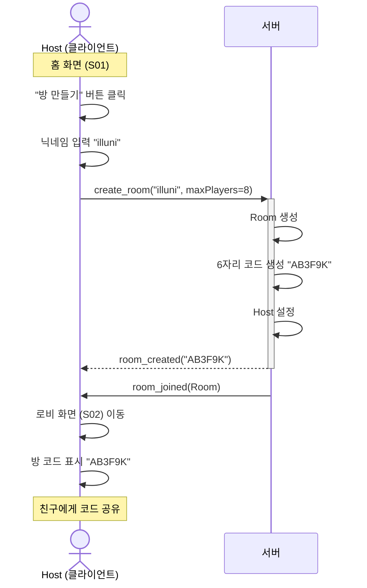

### 1.2 방 참가 (Guest)

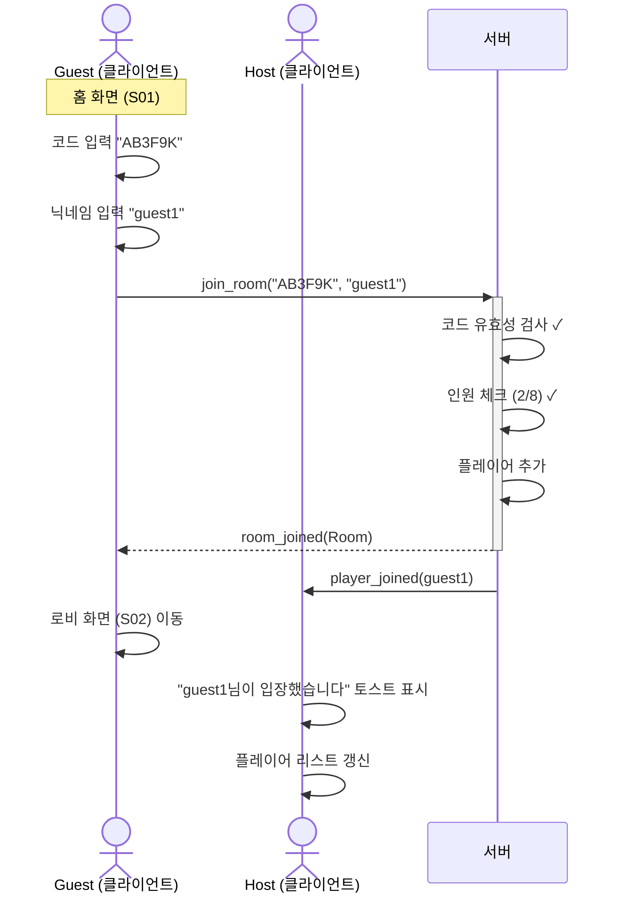

### 1.3 방 참가 실패 (에러 케이스)

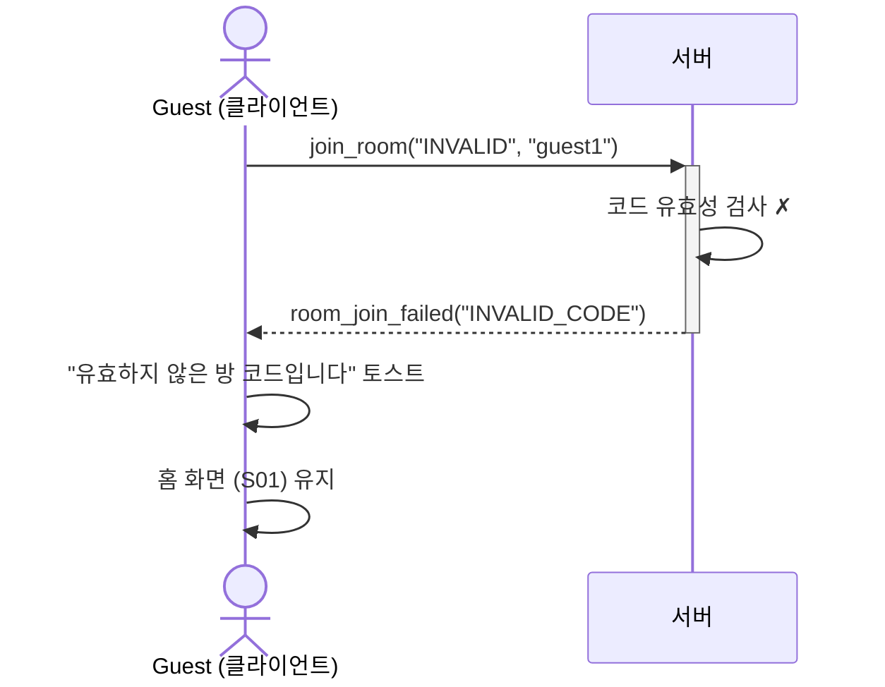

---

## [SEQ-02] 로비에서 게임 시작

### 2.1 Ready 상태 변경

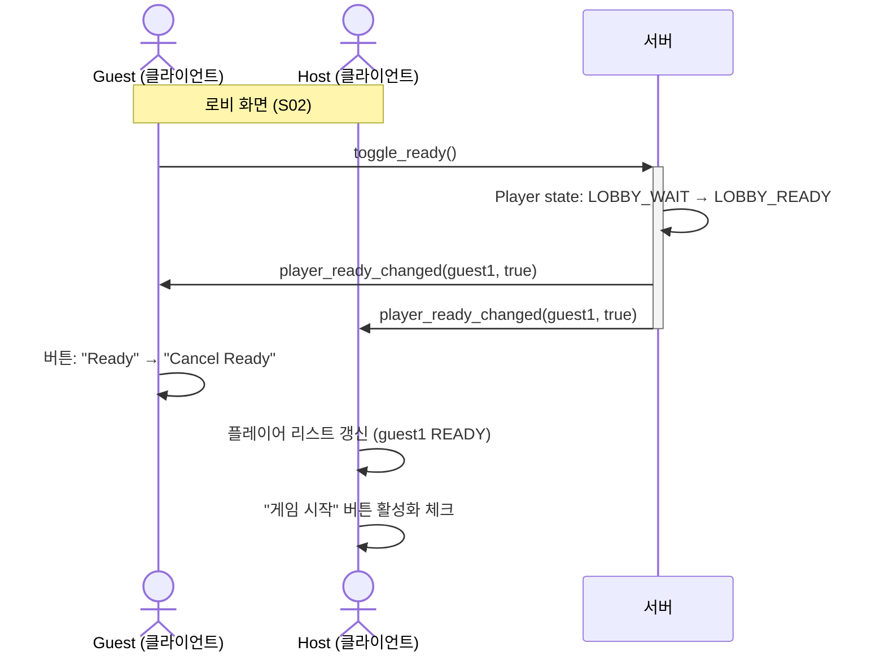

### 2.2 게임 시작 (Host)

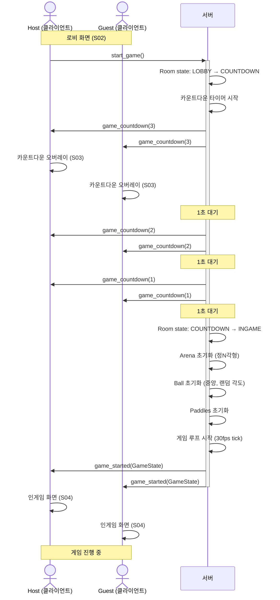

---

## [SEQ-03] 패들 입력 및 히트

### 3.1 패들 이동 (입력 처리)

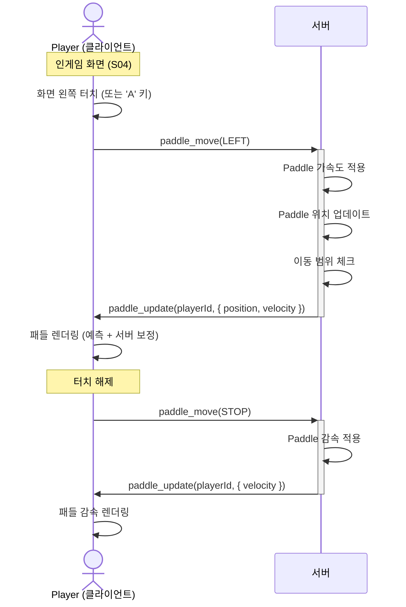

### 3.2 공-패들 충돌 (HIT Pang)

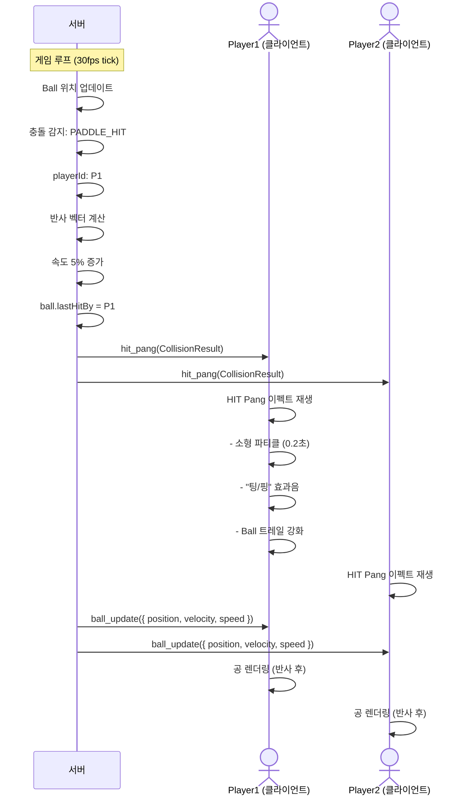

---

## [SEQ-04] OUT 판정 및 Arena 리메시

### 4.1 OUT 판정

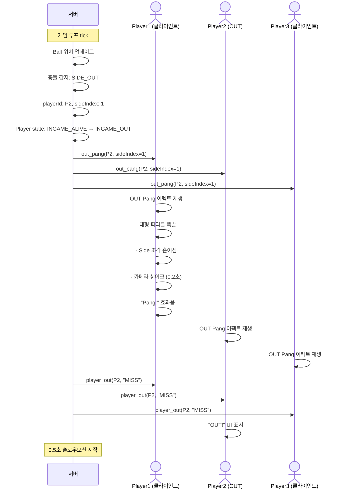

### 4.2 Arena 리메시

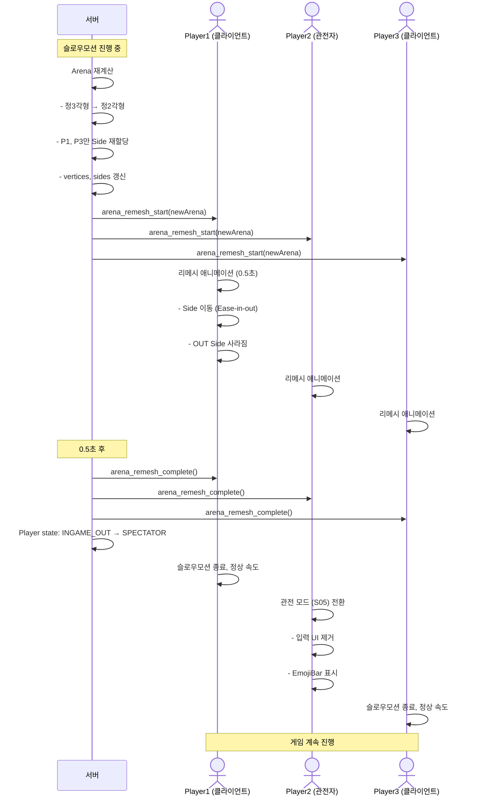

---

## [SEQ-05] 게임 종료 및 결과

### 5.1 게임 종료 (최후의 1인)

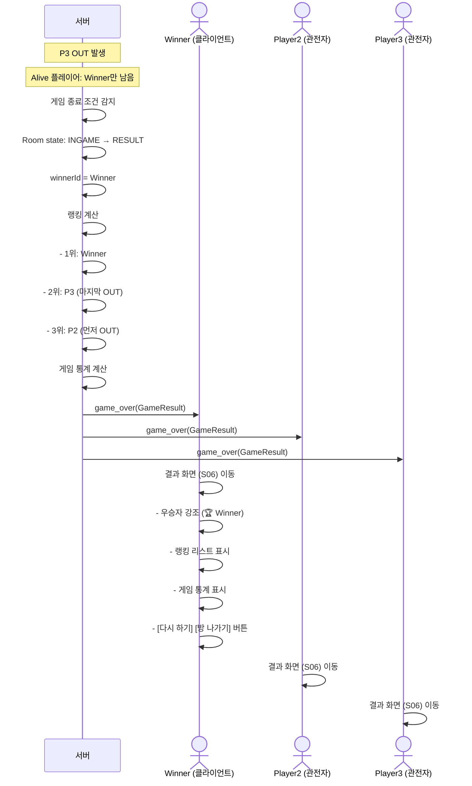

### 5.2 다시 하기

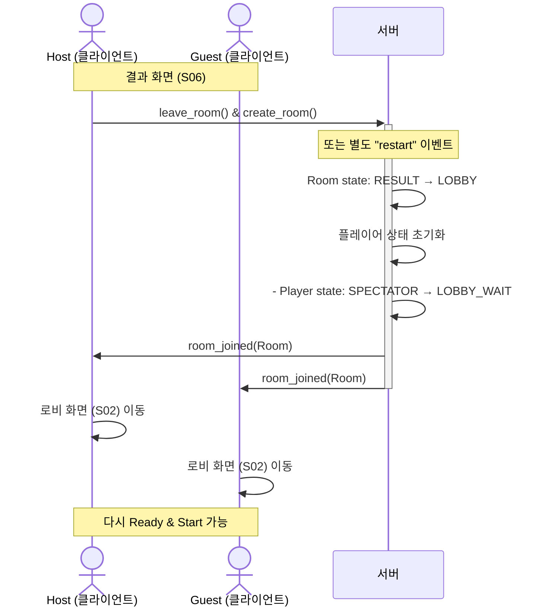

---

## 전체 플로우 요약

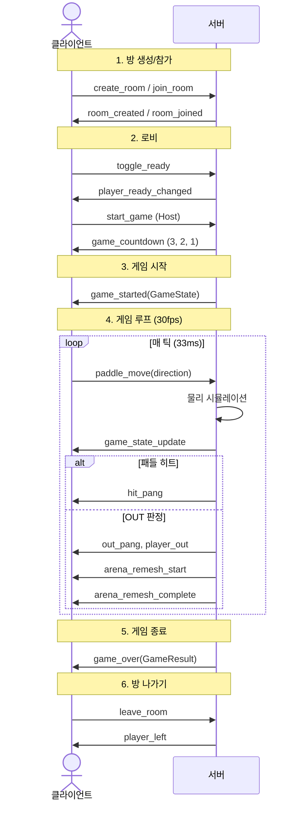

---

## 메시지 빈도 및 우선순위

| 이벤트 | 방향 | 빈도 | 우선순위 | 비고 |
|--------|------|------|----------|------|
| `paddle_move` | C→S | 입력 시마다 | High | 입력 지연 최소화 |
| `game_state_update` | S→C | 30fps | High | 게임 루프 핵심 |
| `ball_update` | S→C | 30fps | High | 게임 루프 핵심 |
| `paddle_update` | S→C | 필요 시 | Medium | 상태 변경 시만 |
| `hit_pang` | S→C | 충돌 시 | Low | 연출용 |
| `out_pang` | S→C | OUT 시 | High | 중요 이벤트 |
| `player_ready_changed` | S→C | Ready 시 | Low | 로비 |
| `game_countdown` | S→C | 1fps × 3초 | Medium | 시작 연출 |

---

## 다음 단계

- **08_API명세서.md**: 각 Socket 이벤트의 페이로드 상세 스펙
- **실제 구현**: TypeScript 타입 + 서버/클라이언트 이벤트 핸들러 작성
